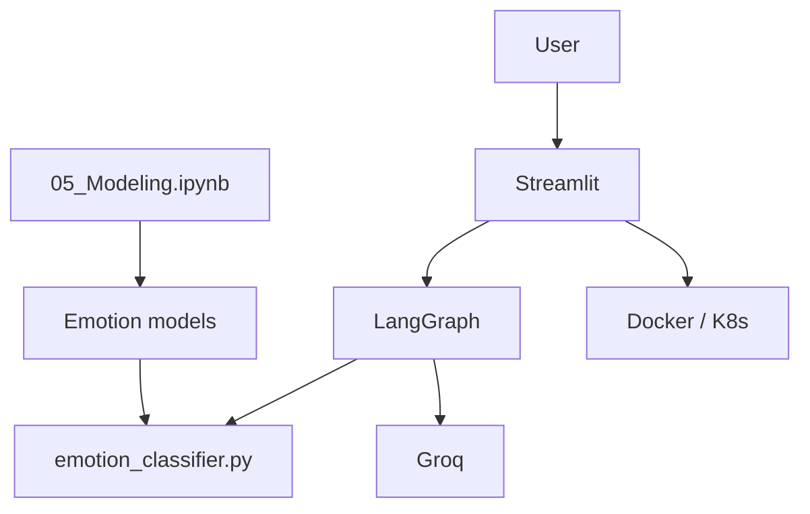
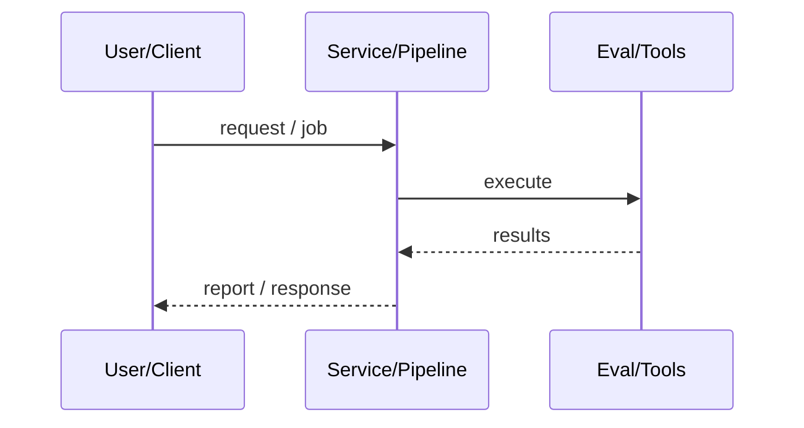
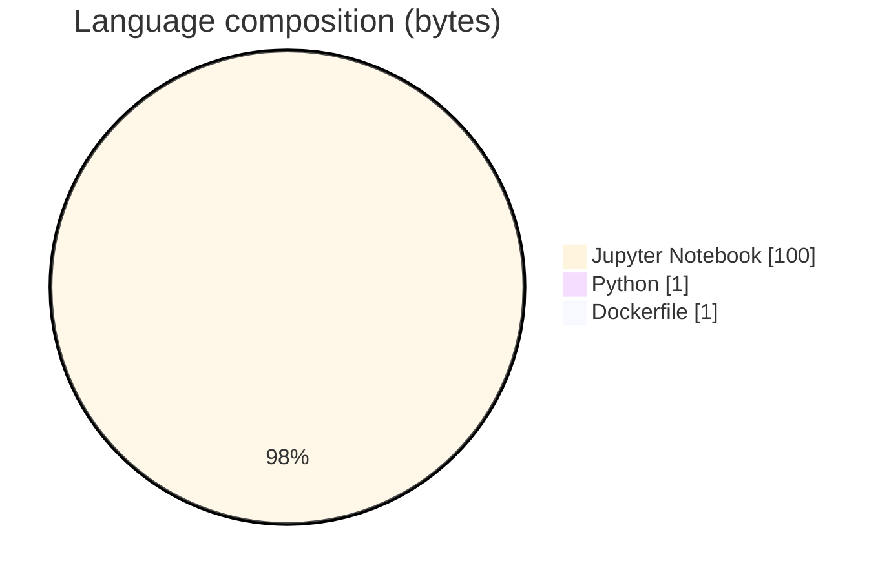

# EmotiCare — Contextual Empathy & Crisis Detection

### Research+product sibling of EmotiCare: modeling notebooks, white paper, Docker/K8s, and LangGraph chatbot with emotion classifier helper.

[](https://github.com/ArchanaChetan07/EmotiCare-An-AI-Based-Approach-to-Contextual-Empathy-and-Emotional-Crisis-Detection)
[](https://github.com/ArchanaChetan07/EmotiCare-An-AI-Based-Approach-to-Contextual-Empathy-and-Emotional-Crisis-Detection)
[](https://github.com/ArchanaChetan07/EmotiCare-An-AI-Based-Approach-to-Contextual-Empathy-and-Emotional-Crisis-Detection)
[](https://github.com/ArchanaChetan07/EmotiCare-An-AI-Based-Approach-to-Contextual-Empathy-and-Emotional-Crisis-Detection/actions)

---

## Overview

Need an end-to-end path from emotion-modeling research to a containerized chatbot emphasizing contextual empathy and distress awareness.

Same Modeling notebook lineage (identical size/content to sibling Modeling.ipynb), white paper PDF, Streamlit/LangGraph app with emotion_classifier.py, Dockerfile + k8s manifests, CI/CD workflow.

Deployable chatbot packaging plus documented research metrics (Macro F1 table as in sibling notebook); packaging is more complete than the underscore-named repo.

This repository is maintained as **production-minded portfolio work**: clear architecture, automated checks where present, and metrics that are **traceable to committed artifacts** (never invented).

---

## Architecture

Gold data → notebooks → models; Chatbot_with_Web LangGraph→Groq/emotion classifier→Streamlit; optional Docker/K8s deploy





---

## Results & repository facts

> Only values found in code, configs, tests, or generated reports are listed. Absence of a clinical/ML accuracy number means it was **not** published in-repo.

| Metric | Value | Source |
|---|---|---|
| Best classical Macro F1 (LogReg weighted) | **0.2921** | `notebook/05_Modeling.ipynb` |
| DistilBERT Top-2 pipeline Macro F1 | **0.2285** | `notebook/05_Modeling.ipynb` |
| BERT+SBERT hybrid Macro F1 @0.65 | **0.2565** | `notebook/05_Modeling.ipynb` |
| Tracked files | **85** | `git tree` |
| Python modules | **23** | `git tree` |
| Test-related paths | **1** | `git tree` |
| CI workflows | **Yes** | `.github/workflows` |
| Docker present | **Yes** | `repo root` |



---

## Key features

- Data cleaning → modeling notebook chain
- Emotion classifier module in chatbot LLM package
- Journal utilities in Streamlit UI
- K8s Deployment/Service/Secret/Namespace
- CI/CD workflow
- White paper artifact

---

## Tech stack

| Layer | Technology |
|---|---|
| language | Python |
| nlp | BERT / DistilBERT / classical ML |
| agent | LangGraph |
| ui | Streamlit |
| deploy | Docker + Kubernetes |
| docs | White Paper PDF |

---

## Skills demonstrated

Jupyter Notebook · scikit-learn · Transformers · LangGraph · Streamlit · Docker · Kubernetes · CI/CD · testing · automation

Keyword surface: **Python · Jupyter Notebook · machine-learning · CI/CD · testing · API · Docker · automation · data-science · software-engineering · system-design · observability · LLM · cloud**

---

## Project structure

```text
EmotiCare-An-AI-Based-Approach-.../
├── notebook/05_Modeling.ipynb
├── Chatbot_with_Web/
├── k8s/
├── Dockerfile
├── White Paper - EmotiCare.pdf
└── tests/
```

---

## Installation & usage

```bash
git clone https://github.com/ArchanaChetan07/EmotiCare-An-AI-Based-Approach-to-Contextual-Empathy-and-Emotional-Crisis-Detection.git
cd EmotiCare-An-AI-Based-Approach-to-Contextual-Empathy-and-Emotional-Crisis-Detection
pip install -r requirements.txt
docker build -t emoticare .
streamlit run Chatbot_with_Web/app.py
```

---

## How it works

Research notebooks establish multilabel emotion performance; the chatbot loads LangGraph flows with an emotion classifier assist and Groq responses; container manifests support deployment.

---

## Future improvements

- Deduplicate Modeling notebook with sibling repo via submodule
- Add crisis detection evaluation set with committed scores
- Clarify relationship between the two EmotiCare repositories in README

---

## License

See repository.

---

<p align="center">
  <b>EmotiCare — Contextual Empathy & Crisis Detection</b><br/>
  <a href="https://github.com/ArchanaChetan07/EmotiCare-An-AI-Based-Approach-to-Contextual-Empathy-and-Emotional-Crisis-Detection">github.com/ArchanaChetan07/EmotiCare-An-AI-Based-Approach-to-Contextual-Empathy-and-Emotional-Crisis-Detection</a>
</p>
