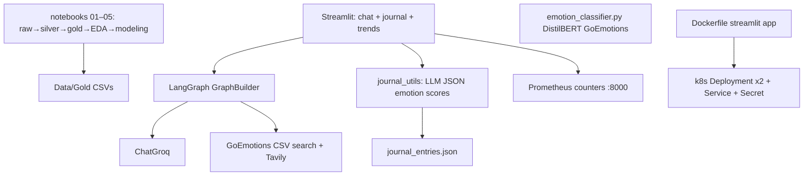

# EmotiCare — Contextual Empathy & Emotional Crisis Detection

### Notebook research + LangGraph Streamlit app (journals, DistilBERT emotions, Docker/K8s)

[](https://github.com/ArchanaChetan07/EmotiCare-An-AI-Based-Approach-to-Contextual-Empathy-and-Emotional-Crisis-Detection/actions/workflows/ci-cd.yml)
[](https://www.python.org/)
[](Dockerfile)
[](Chatbot_with_Web/app.py)

End-to-end EmotiCare stack for emotion-aware support work: **five notebooks** clean three corpora into gold CSVs and compare multi-label emotion models; a **Streamlit + LangGraph** app adds Groq chat, optional web tools, LLM-scored journaling with trend charts, a Hugging Face DistilBERT GoEmotions classifier module, Prometheus counters, and manifests for Docker + Kubernetes deploy.

Companion write-up: `White Paper - EmotiCare.pdf`.

---

## Key Results

| Metric | Value | Source |
|---|---|---|
| Gold rows — GoEmotions | **57,732** | `Data/Gold/goemotions_gold.csv` |
| Gold rows — Facebook posts | **129,264** | `Data/Gold/facebook_gold.csv` |
| Gold rows — CounselChat | **4,603** | `Data/Gold/counselchat_gold.csv` |
| Best overall Macro F1 (multi-label) | **0.3133** @ thr. **0.65** | `notebook/05_Modeling.ipynb` (weighted LogReg) |
| Matching Micro F1 / Hamming | **0.3487** / **0.0642** | same |
| Distressed-label F1 examples (LogReg@0.65) | fear **0.3776**, sadness **0.3258**, grief **0.0845** | per-label table in `05_Modeling.ipynb` |
| HF emotion model (app module) | `joeddav/distilbert-base-uncased-go-emotions-student` | `LLMS/emotion_classifier.py` |
| Unit tests | **8** | `tests/test_emoticare.py` |
| Deploy path | Dockerfile (8501) + `k8s/` (2 replicas) + CI build/push/deploy | `.github/workflows/ci-cd.yml` |

> No committed crisis-precision/recall or empathy Likert scores — do not invent them. Crisis coverage in tests is **keyword set membership**, not a trained crisis model.

---

## Architecture



**How it works:** modeling notebooks establish multi-label baselines on GoEmotions; the app path uses Groq for chat/journaling and can load a pretrained DistilBERT student for GoEmotions scores. Journal intensities are stored locally and plotted (`joy` / `sadness`). Optional CI pushes a container and applies Kubernetes manifests when Docker Hub secrets are configured.

---

## Tech Stack

| Layer | Choice |
|---|---|
| Research | Jupyter (`notebook/01`…`05`) · scikit-learn · DistilBERT / SBERT experiments |
| App | Streamlit · LangGraph · LangChain · Groq · Tavily |
| Emotions | HF DistilBERT GoEmotions student · Groq JSON journal scoring |
| Ops | Docker · Kubernetes YAML · Prometheus client · GitHub Actions CI/CD |

---

## Features

- Pipeline notebooks for CounselChat / Facebook / GoEmotions gold
- Basic chatbot + tool-enabled LangGraph use cases
- Journal save + emotion trend line chart
- DistilBERT `predict_emotions()` helper (top-5 scores)
- Healthcheck on Streamlit `/_stcore/health`
- K8s probes, resource limits, secret-driven env

---

## Installation & Usage

```bash
git clone https://github.com/ArchanaChetan07/EmotiCare-An-AI-Based-Approach-to-Contextual-Empathy-and-Emotional-Crisis-Detection.git
cd EmotiCare-An-AI-Based-Approach-to-Contextual-Empathy-and-Emotional-Crisis-Detection

python -m venv .venv
source .venv/bin/activate   # Windows: .venv\Scripts\activate
pip install -r Chatbot_with_Web/requirements.txt
# DistilBERT path needs: pip install torch transformers
```

```bash
cd Chatbot_with_Web
streamlit run app.py
# or run prometheus-capable entry:
python -m src.langgraphagenticai.main
```

```bash
docker build -t emoticare .
docker run -p 8501:8501 emoticare
pytest tests/test_emoticare.py -q
```

---

## Project Structure

```text
├── Chatbot_with_Web/                 # Streamlit + LangGraph app
│   ├── app.py
│   └── src/langgraphagenticai/
│       ├── main.py                   # chat + journal + Prometheus
│       ├── LLMS/emotion_classifier.py
│       ├── LLMS/groqllm.py
│       ├── graph/graph_builder.py
│       ├── tools/search_tool.py
│       └── ui/streamlitui/           # loadui, display, journal_utils
├── Data/Gold/                        # gold CSVs
├── notebook/01…05_*.ipynb            # research pipeline
├── k8s/                              # deployment, service, secret, namespace
├── Dockerfile
├── White Paper - EmotiCare.pdf
├── tests/test_emoticare.py
└── .github/workflows/ci-cd.yml
```

---

## Future Improvements

- Wire `emotion_classifier.predict_emotions` into the journal path (today journaling uses Groq JSON)
- Replace `eval()` on LLM JSON with `json.loads` + schema validation
- Add a dedicated crisis classifier with held-out precision/recall in CI artifacts
- Run pytest in the GitHub Actions `test` job (currently lint-focused)

---

## License

See repository license file if present.
